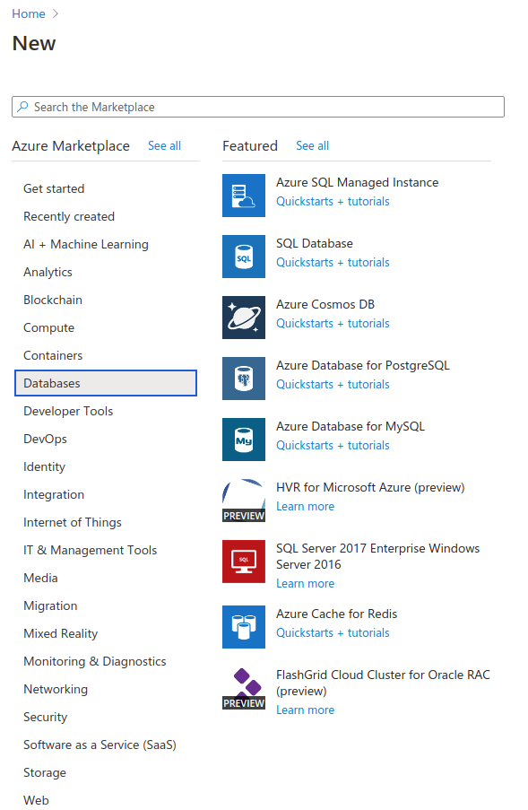
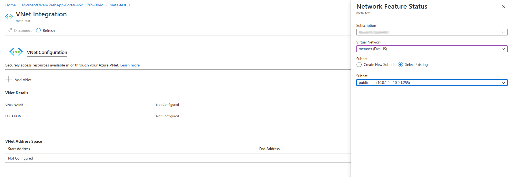

**Covered in this guide:**

# Running Metabase on Microsoft Azure

This guide will cover the basics for running your Metabase instance in Microsoft Azure thanks to the power and flexibility of Docker Containers. At the end of this guide you will have set up a Metabase instance with its own database, ready to be scaled in case you need more power.

## Components

For Metabase to work you will need:
- A resource group: where you will have all your assets for easy identifying all the components that Metabase has.
- A VNET: a virtual network that hosts Metabase server and it's application database.
- An Azure Database for PostgreSQL server: a database server that Metabase uses as the application database where it saves all its data. This component can be switched to an Azure Database for MySQL if your tune is the MySQL one.
- A private endpoint connection: so database can be accessed from an internal IP address rather than being exposed to the public.
- A web app: a deployment of an application fully managed by Azure, either by an executable or a Docker container.

## Steps

### Step 1: Create the resource group

On the Azure management console, click on the **Resource Groups** icon at the top of the page or search for Resource Groups to enter that section. If you have a resource group already created, you can skip this step and go straight to [Step 2](#step-2-create-the-network).

On the resource group page, click on the **+ Add** button in the top bar to create a new resource group. On the **Create a resource group** page that opens, select your valid Azure Subscription, enter a resource group name and select a region.

Once you've selected the name and region of your resource group click on **Next** on the button at the bottom of the page till you get to the final screen where you can hit the **Create** button.

__NOTE__: remember that you need to select the region for your Metabase instance according to the location of your users, data warehouse and even the cost of the infrastructure of the region or privacy laws that might restrict cross-border data transfers.

### Step 2: Create the network

Once your resource group is created, click on the name to open the page where you will start creating all your resource. Click on the **Create resources** button at the center of the page and you will be taken to the marketplace menu where you will have to search for the keyword **VNET**:

From all the offerings, select the VNET product from Microsoft and click on **Create**:

You will be presented with a screen similar to the one you were shown when created the resource group, where you will have to enter a name for the virtual network and select a region for it (remember to use the same region for all the components you create, you don't want your data to be travelling worldwide!) and click on **Next: IP Addresses** button at the bottom.

Here we will create a simple but secure network topology, composed of a public subnet (a network that is exposed to the internet), and a private network that will contain your application database which will be inaccesible from the outside.

In the IPv4 address you should have a default value of 10.0.0.0/16 (otherwise add that network space to the box) and then add two subnets, one named public, with the subnet address range of 10.0.1.0/24 and one named private with the subnet range of 10.0.2.0/24.

Hit **Next** button till you get to the **Review and create** page where you can click on the create button at the bottom to start the creation of your network.

### Step 3: Create the database

Now head back to the Resource Group you created or the Azure Management console homepage, and create a new resource. This time search for **Azure Database for PostgreSQL**. You can find this one more easily by selecting **Databases** in the Marketplace menu.

In the next page you will have to select the way you will use the service. Choose **Single server** for now, which is a good starting point, but take into account that this will create just one instance of PostgreSQL that will be your single point of failure.

On the next screen, select or enter the following:
- Resource group: the one you are including all your components
- Server name: a unique name for your database
- Data Source: can be left as `None`
- Location: the same one you used for your Resource Group and VNET
- Version: use the latest one you can
- Compute + Storage: you can re-dimension your database but it's mandatory to select a `General Purpose` tier as it's the only that provides a Private Link at the time of the writing of this guide.
- choose an admin username and password of your choice

Click **Next** till you get to the final page where you can click on **Create** button so your database starts the creation process. Now, you need to wait till the creation of the database is over so you can include it in your VNET and create the internal connection to it. Once the creation is over, click on the **Go to resource** button that appears on the page.

### Step 4: Create the private endpoint connection

On the properties page for the Azure for PostgreSQL database, you will be able to manage all parameters about your database. Here we will create the **Private Endpoint** to the database, so all traffic from the web application is routed internally through Azure's network.

On the left bar, click on **Private endpoint connection** which is situated under **Security**

Now click on the button of the top with a plus sign that says **Private endpoint** and a new page opens:
1) Provide a name for this link (any name that describes what you are trying to do is ok, like `metabase_link`). Select the region where the database lives, click Next.
2) On the **Resource** section of the configuration, ensure that **Resource type** is set to `Microsoft.DBforPostgreSQL/servers` which will enable you to select in the dropdown below the server created in the previous step, and leave **Target sub-resource** with the default value
3) On the **Configuration** section, the only value that needs to be changed is the **Subnet** one, where you need to select the **private** subnet that you created on the first step of this guide, and leave everything else as it is.

Now go to the last step and click **Create**. Once the link finishes its creation, you will need two more things to go to the next step:
1) Go to the database Connection Security item and deny all public network access
2) go to the VNET component and in the **Connected devices** settings option, you will now see that a device connected to the network with an IP Address. Take down that IP Address as it will be needed in the next step.

### Step 5: Create web application

At last, the step where all the magic comes together: go to your resource group and add a new resource, or search for **Web App** in the Marketplace (blue globe icon)

Now set up the following values on the page (resource group should be the same as in the first step):
- Name: choose any name, but is has to be unique as the subdomain is shared across all Azure deployments
- Publish: Docker Container
- Operating System: Linux
- Region: same as the one on the previous steps
- App Service Plan: if you don't have one already, it will create a new one automatically
- SKU and Size: change it to a Production level plan with **AT LEAST** 200 total ACU and 3.5GB of memory, click **Apply** after choosing the specs.

Now go to the next step where you will select:
- Options: single container
- Image source: DockerHub
- Access Type: Public
- Image and tag: metabase/metabase:latest (or choose any other docker image tag)
- Startup command: empty

Click next till you get to the last section and click on **Create** to initialize the creation of your application and wait till it's over.

Now go to te application configuration page and click on Settings --> Networking on the left side of the page, where a page will appear and you will have to click on **Click here to configure** under **VNET integration**.

Now click on the huge plus sign next to **Add VNET** and select the VNET that you created on the first step and the public subnet to set the server on the public subnet of the VNET, and click OK.

Now go back to te application configuration page and click on Settings --> Configuration on the left side of the page where you will see a few Application Settings already configure.

Here you will need to add the [Enviroment Variables]() for connecting Metabase to its [PostgreSQL Application Database](), but make sure that you use the **MB_DB_CONNECTION_URI** as PostgreSQL in Azure is configured by default with SSL so currently the only way of passing those parameters is by using the full URI.

Also, take into account that the username in Azure PostgreSQL is `user@databasename` so in this case the entire connection uri would be as follows: `postgresql://databasePrivateIPAddress:port/postgres?user=user@databasename&password=configuredpassword&ssl=true&sslfactory=org.postgresql.ssl.NonValidatingFactory`

## How to enable Health checks

TODO

## How to update

## How to see the logs

Deployment center -> Logs